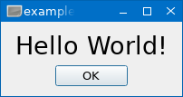

# lqtk - Lua Qt Toolkit
[](LICENSE)
[](https://luarocks.org/modules/osch/lqtk)

<!-- ---------------------------------------------------------------------------------------- -->

A Lua binding for [Qt 6.9] and [Qt 6.10].

This is work in progress. You may have a look at the [Examples].

<!-- ---------------------------------------------------------------------------------------- -->

## First Example

* A simple "Hello World" dialog.

     

    ```lua
    local lqtk = require("lqtk")
    
    lqtk.import()
    
    QApplication(arg)
    
    local window = QWidget() do
        local label  = QLabel("Hello World!") do
            local font = QFont()
            font:setPointSize(2 * font:pointSize())
            label:setFont(font)
            label:setAlignment(Qt.AlignCenter)
        end
        local buttons = QDialogButtonBox() do
            buttons:setCenterButtons(true)
            local button = buttons:addButton(QDialogButtonBox.Ok) do
                button:connect("clicked()", function() 
                    QApplication.exit() 
                end)
            end
        end
        local layout = QVBoxLayout(window) do
            layout:addWidget(label)
            layout:addWidget(buttons)
        end
    end
    window:show()
    
    QApplication.exec()
    ```


<!-- ---------------------------------------------------------------------------------------- -->

[Qt 6.9]:                   https://doc.qt.io/qt-6.9/
[Qt 6.10]:                  https://doc.qt.io/qt-6/
[Examples]:                 ./example/README.md#lqtk-examples

<!-- ---------------------------------------------------------------------------------------- -->


