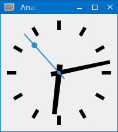
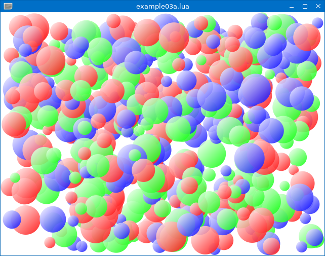

# lqtk Examples
<!-- ---------------------------------------------------------------------------------------- -->

   * [`example01.lua`](./example01.lua)
     
     A simple "Hello World" dialog.

     
     

<!-- ---------------------------------------------------------------------------------------- -->

   * [`example02.lua`](./example02.lua)
     
     Analog Clock example, ported from the original [Qt Analog Clock example](https://doc.qt.io/qt-6.9/qtwidgets-widgets-analogclock-example.html).
     
     
     
<!-- ---------------------------------------------------------------------------------------- -->

   * [`example03a.lua`](./example03a.lua)
     
     A mini game demonstrating smooth animations.
     
   * [`example03b.lua`](./example03b.lua)
     
     Improved performance using pre-rendered QPixmap objects.
          
     
     
<!-- ---------------------------------------------------------------------------------------- -->

